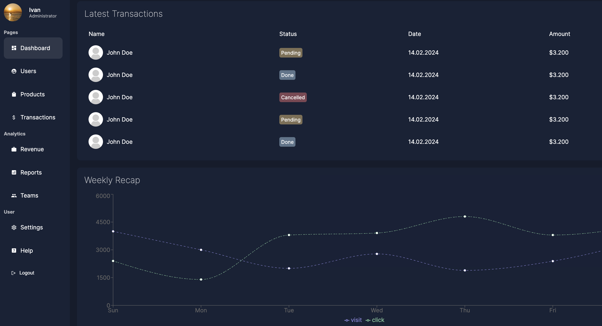

## Admin Dashboard with Server Actions
[Next.js](https://nextjs.org/) project, under node 18.17.0

### 🚀 Dependencies:

```bash
npm i react-icons@4.11.0 recharts@2.9.0 mongoose@8.0.2 use-debounce@9.0.4 bcrypt@5.1.1 next-auth@beta
```

### 🔥 Run server:

```bash
npm run dev
```

### 💎 UI:

